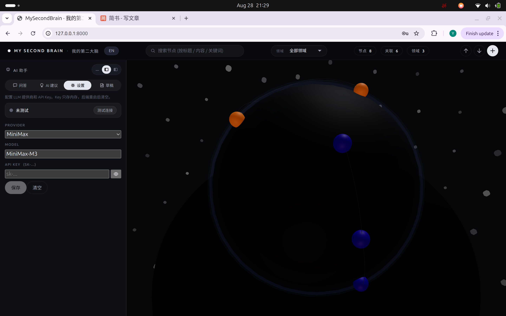
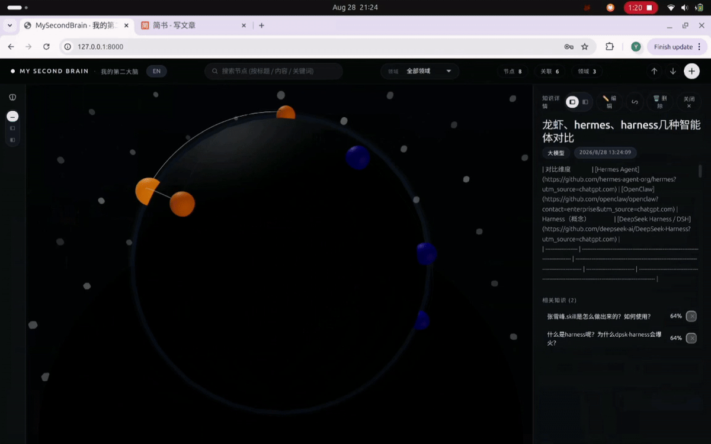

# MySecondBrain · Your Second Brain

> An AI-driven personal knowledge graph + long-term memory system — turn scattered notes, learnings, experiences, and ideas into an explorable, growing, comprehensible 3D personal knowledge universe.

<div align="center">
  <a href="./README.CN.md"><b>🇨🇳 中文</b></a> &nbsp;
  <a href="./README.md"><b>🇺🇸 English</b></a>
</div>



---

## 0. Prerequisites & Start

### 0.1. Install PG + pgvector + node20 + uv (one-time, on Ubuntu/Debian)

```bash
sudo apt-get install -y postgresql-16 postgresql-16-pgvector curl git
curl -fsSL https://deb.nodesource.com/setup_20.x | sudo -E bash -
sudo apt-get install -y nodejs
curl -LsSf https://astral.sh/uv/install.sh | sh
```

### 0.2. Start PG and create the user/db

```bash
sudo pg_ctlcluster 16 main start
sudo -u postgres psql <<'SQL'
CREATE USER my2ndbrain WITH PASSWORD 'change-me';
CREATE DATABASE my2ndbrain OWNER my2ndbrain;
ALTER USER my2ndbrain CREATEDB;
\c my2ndbrain
CREATE EXTENSION IF NOT EXISTS vector;
SQL
```

### 0.3. Clone and start

```bash
git clone https://github.com/hyongtao-code/my2ndbrain.git && cd my2ndbrain
./compose.sh start                    # Docker compose path
# or:
./start.sh start                      # Native path — auto-runs uv sync + npm install
```

Open `http://localhost:8000/`.
See `http://localhost:5173/` for dev.

---

## 1. Overview

**MySecondBrain** is a 100% local, ready-to-use "**Second Brain**" application — all your scattered knowledge (notes, questions, ideas, book excerpts, chat conversations) is **automatically** organized as nodes on a 3D sphere. The system will:

- Store anything you input
- LLM-assisted keyword extraction and category inference
- LLM-assisted edge creation (who is related to whom)
- LLM-assisted category clustering (like "AI" / "Japanese Sengoku" / "Python")
- RAG-based retrieval and Q&A
- Clean up rough drafts into structured knowledge nodes

> Compared to Notion / Obsidian / Logseq, MySecondBrain emphasizes:
>
> - **LLM actively participates** (auto-linking, auto-categorization, auto Q&A)
> - **3D visualization** (sphere + auto-rotation + drag + relation lines)
> - **Works offline** (local LLM + local embeddings)

---

## 2. Architecture

### 2.1 Top-level architecture

```
┌──────────────────────────────────────────────────┐
│  Browser (any device)                            │
│  React SPA → 3D sphere + nodes + relation lines  │
│  HTTPS/HTTP over port 8000                       │
└────────────────────┬─────────────────────────────┘
                     │
                     ▼
┌──────────────────────────────────────────────────┐
│  FastAPI (Python 3.11)                           │
│  - /api/nodes, /api/drafts, /api/graph           │
│  - /api/llm/* (settings / draft curation / RAG)  │
│  - serves the frontend dist/ statically          │
│  uvicorn 0.27  ·  port 0.0.0.0:8000              │
└────┬───────────────────────────────────┬─────────┘
     │                                   │
     ▼                                   ▼
┌────────────────────┐         ┌─────────────────────┐
│  PostgreSQL 16     │         │  Embedding model    │
│  + pgvector ext    │         │  sentence-transform │
│  - knowledge_node  │ ◄──────│  (or TF-IDF offline)│
│  - knowledge_edge  │         └─────────────────────┘
│  - knowledge_draft │
│  - category_cluster│
│  port 5432 (local) │
└────────────────────┘
```

### 2.2 Frontend modules

| Module | File | Responsibility |
|---|---|---|
| 3D sphere | `KnowledgeSphere.tsx` | three.js + R3F renders nodes, relation lines, auto-rotation, mouse drag |
| AI assistant panel | `AssistantPanel.tsx` | Ask / Suggest / Settings / Draft — 4 tabs, expandable to the left half |
| Node detail | `NodeDetail.tsx` | View / edit title, content, category, relations |
| Draft | `DraftPanel.tsx` | Quick capture → AI curation → promote to node |
| Import | `ImportModal.tsx` | Bulk-upload `.md` files (multi-select) |
| Export | `ExportModal.tsx` | Multi-select nodes → zip / single `.md` download |
| FAB | `App.tsx` bottom-right | Floating action buttons (add node / import / export) |
| Search | `App.tsx` top | Real-time dropdown (title / content / keywords, top 5) |
| i18n | `i18n/` | Switch between zh-CN (default) and English |

### 2.3 Backend core API

| Path | Purpose |
|---|---|
| `GET /api/health` | Health check (returns the active embedding backend) |
| `GET /api/nodes` | List all nodes |
| `POST /api/nodes` | Create a node |
| `PATCH /api/nodes/{id}` | Edit a node |
| `DELETE /api/nodes/{id}` | Delete a node |
| `GET /api/drafts` | List drafts |
| `POST /api/drafts` | Create a draft (quick capture) |
| `POST /api/llm/curate/clean-draft` | **AI clean up a draft** → standard node |
| `POST /api/llm/curate/find-merges` | **AI suggest merges** (similar nodes) |
| `POST /api/llm/curate/find-edges` | **AI suggest new relations** (same-category nodes) |
| `POST /api/llm/curate/ask` | **RAG Q&A** (based on your knowledge base) |
| `POST /api/llm/config` | Configure LLM provider / key / model |
| `POST /api/llm/test` | Test LLM connection |
| `GET /api/graph` | Return nodes + edges (for the 3D sphere) |
| `POST /api/nodes/import-md` | Bulk-upload `.md` files |
| `GET /api/nodes/{id}/export-md` | Export a single node as `.md` |
| `POST /api/nodes/export-md-batch` | Multi-node export as a zip |

### 2.4 Data model

```sql
-- A node = one piece of knowledge
knowledge_node(id, title, content, source, category,
               importance, keywords, embedding vector(384), created_at, updated_at)
-- source: 'manual' | 'md-import' | 'llm-clean' | 'llm-merge'
-- embedding: sentence-transformers/all-MiniLM-L6-v2 (or TF-IDF fallback)

-- An edge = relation between two nodes
knowledge_edge(id, source_id, target_id, relation, weight, created_at)

-- A draft = a rough, uncurated note
knowledge_draft(id, content, source, promoted_to_node_id, created_at)

-- A category cluster
category_cluster(id, name, description, centroid vector(384), node_count)
```

---

## 3. Usage

This repo provides two startup paths. Pick one:

> Do NOT run `./start.sh start` and `./compose.sh start` at the same time — both want port 8000, and will conflict!

### 3.1 Native dev startup (recommended for developers)

> `./start.sh` runs uvicorn + vite dev directly, no Docker.

```bash
git clone https://github.com/hyongtao-code/my2ndbrain.git
cd my2ndbrain

# One command to start. Prereqs: PostgreSQL 16 + pgvector + Python 3.11 + Node 20
./start.sh start      # start backend + frontend
./start.sh stop       # stop both
./start.sh status     # show status + port usage
./start.sh logs       # tail the last 20 lines of backend + frontend logs
./start.sh reset      # restart only — does NOT touch the database (see cmd_reset comment)
./start.sh help       # full help

./scripts/setup_pg.sh check    # silently check DB + pgvector, prints fix on failure
./scripts/setup_pg.sh doctor   # verbose walkthrough
```

### 3.2 Docker compose startup

> `./compose.sh start` is the Docker compose path — Postgres + pgvector + backend + frontend all bundled in one image.

```bash
# Prereq: Docker 20+ installed
git clone https://github.com/hyongtao-code/my2ndbrain.git
cd my2ndbrain

# One command to start (first run auto-builds the image, 5-10 min)
./compose.sh start                     # smart: build only if image is missing
./compose.sh start --rebuild          # force a fresh build
./compose.sh start --pull             # pull the latest base image before building
./compose.sh start --help             # full help
./compose.sh stop                      # stop the container (data kept)
./compose.sh stop --rm                 # stop and remove the container (data still kept)
./compose.sh --help                    # full help

# Browser access:
# http://localhost:8000/   (FastAPI + React build)

# Data persistence:
#   -v my2ndbrain-data:/var/lib/postgresql/data
# The container's PGDATA is mounted to a Docker managed volume named
# `my2ndbrain-data`. The volume persists across container rebuilds /
# restarts / image swaps. To migrate to a new host, export the
# volume first, then restore it on the new host.

# Wipe all data (destructive):
docker volume rm my2ndbrain-data
```

After startup, you'll see:

```
Web UI    : http://<host>:8000/
Health    : http://<host>:8000/api/health
Swagger   : http://<host>:8000/docs
Data      : stored in named volume 'my2ndbrain-data'
```

## 4. 📹 Demo show



---

## 5. Acknowledgements

All code was generated by [hermes](https://github.com/NousResearch/hermes-agent) and [Minimax-M3](https://github.com/MiniMax-AI/MiniMax-M3.git). The UI was enhanced with the [ui-ux-pro-max-skill](https://github.com/nextlevelbuilder/ui-ux-pro-max-skill).